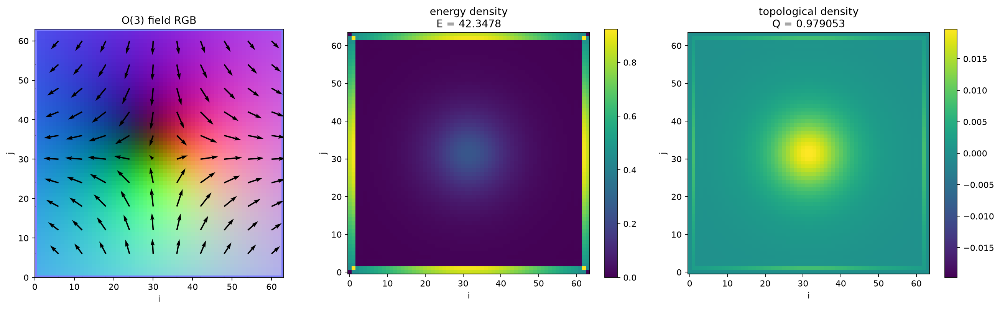
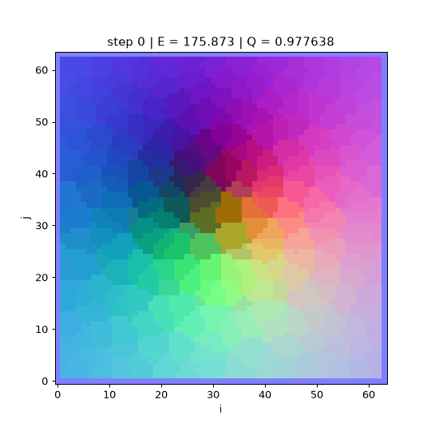
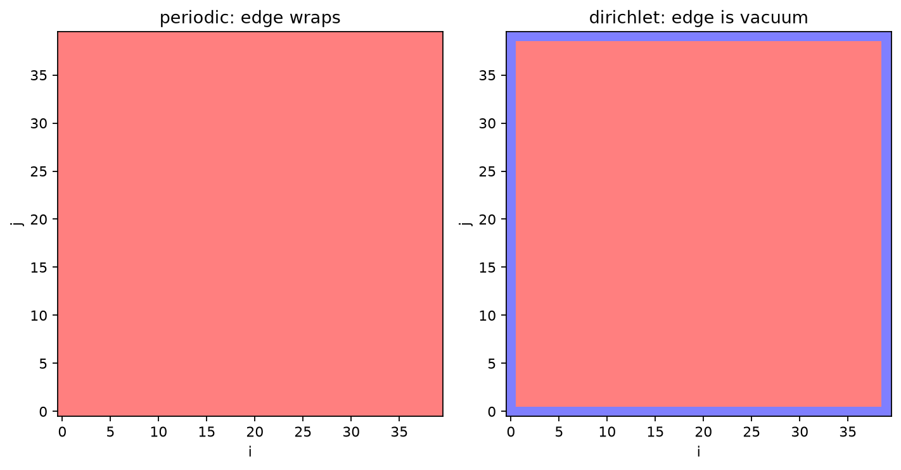
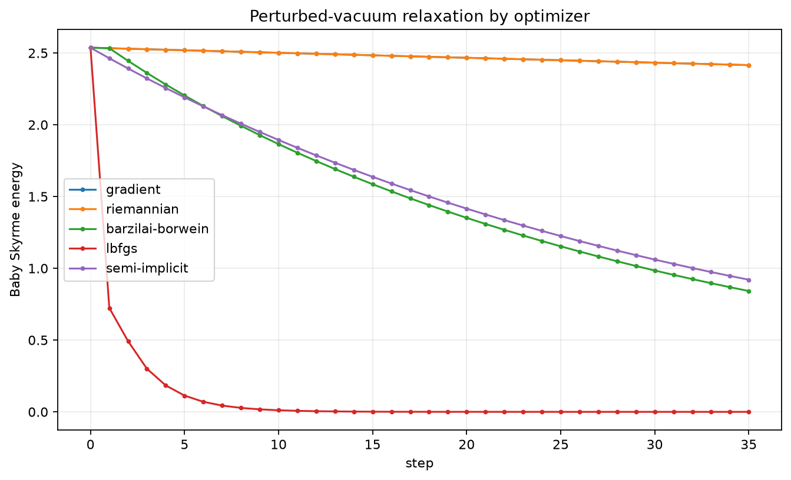

# solitonkit Documentation

`solitonkit` is a compact toolkit for experiments with O(3) fields and baby
Skyrmions. It pairs a C++ numerical core with a Python API for scripting,
visualization, animations, and data generation.

## What You Can Do

- Generate single and multi-Skyrmion initial conditions.
- Compute energy density, total energy, topological density, and topological
  charge.
- Inspect Baby Skyrme energy components, including DMI.
- Relax fields with gradient flow, Riemannian exponential-map descent,
  Barzilai-Borwein, L-BFGS, or semi-implicit flow.
- Evolve fields with damped Landau-Lifshitz dynamics.
- Save fields to `.npz`, records to `.csv`, figures to `.png`, and relaxation
  processes to `.gif` or `.mp4`.

## Suggested Reading Order

1. [Quickstart](quickstart.md)
2. [Theory Notes](theory.md)
3. [Python API Overview](python-api.md)
4. [CLI Guide](cli.md)
5. [Demo Notebook](../notebooks/01_solitonkit_demo.ipynb)

## Visual Tour

Gradient flow relaxation:

Boundary conditions:

Optimizer comparison on a perturbed vacuum field:

