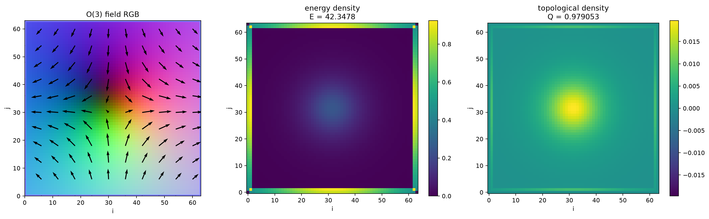
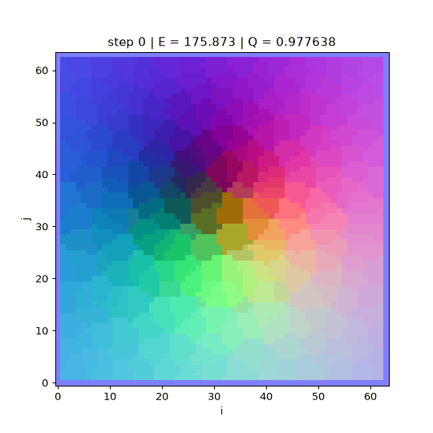
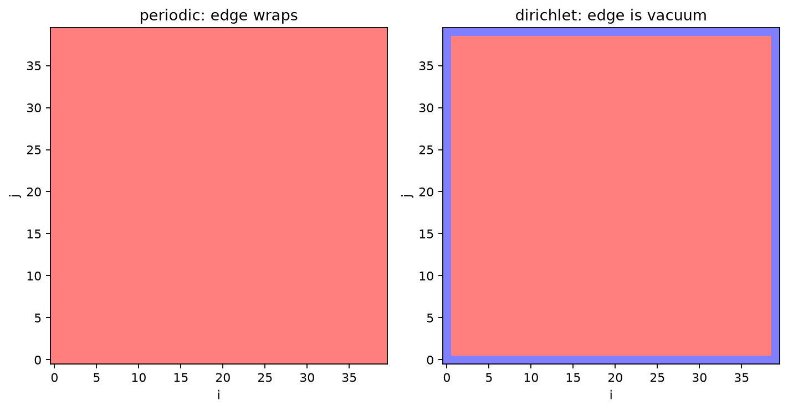
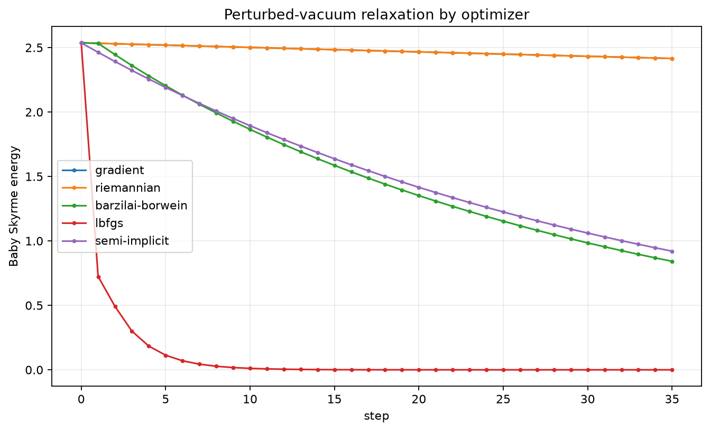

# solitonkit Documentation

`solitonkit` is a compact toolkit for scalar, XY, O(3), micromagnetic, and
Hopfion field experiments. It pairs a header-only C++17 numerical core with a
Python API for scripting, visualization, animations, and data generation.

## What You Can Do

- Generate single and multi-Skyrmion initial conditions.
- Generate 3D rational-map Hopfions with configurable windings.
- Work with axis-specific boundary conditions and shared differential operators.
- Use a common `Model` API through `minimize()` and `solve()`.
- Compute low Hessian eigenmodes and diagnose linear stability matrix-free.
- Solve stationary equations with damped Newton-Krylov and restarted GMRES.
- Trace branches with adaptive pseudo-arclength continuation and stability
  tracking.
- Detect vortices, compute geometric degree and numerical Hopf charge, and run
  parallel phase-diagram sweeps.
- Simulate XY, phi4, Sine-Gordon, and complete 2D micromagnetic energies.
- Compute energy density, total energy, topological density, and topological
  charge.
- Inspect Baby Skyrme energy components, including DMI.
- Relax fields with gradient flow, Riemannian exponential-map descent,
  Barzilai-Borwein, L-BFGS, or semi-implicit flow.
- Evolve fields with damped Landau-Lifshitz or Heun LLG dynamics.
- Save fields to `.npz`, complete runs/checkpoints to HDF5, records to `.csv`,
  figures to `.png`, and relaxation processes to `.gif` or `.mp4`.

## Suggested Reading Order

1. [Quickstart](quickstart.md)
2. [Theory Notes](theory.md)
3. [Python API Overview](python-api.md)
4. [Models, Boundaries, and Solvers](models-solvers.md)
5. [Linear Stability Analysis](stability-analysis.md)
6. [3D Fields and Hopfions](three-dimensional.md)
7. [Stationary Solvers And Research Workflows](research-workflows.md)
8. [CLI Guide](cli.md)
9. [Publishing To PyPI](pypi-release.md)
10. [Demo Notebook](https://github.com/badpocyk/solitonkit/blob/main/notebooks/01_solitonkit_demo.ipynb)

## Visual Tour

Gradient flow relaxation:

Boundary conditions:

Optimizer comparison on a perturbed vacuum field:

